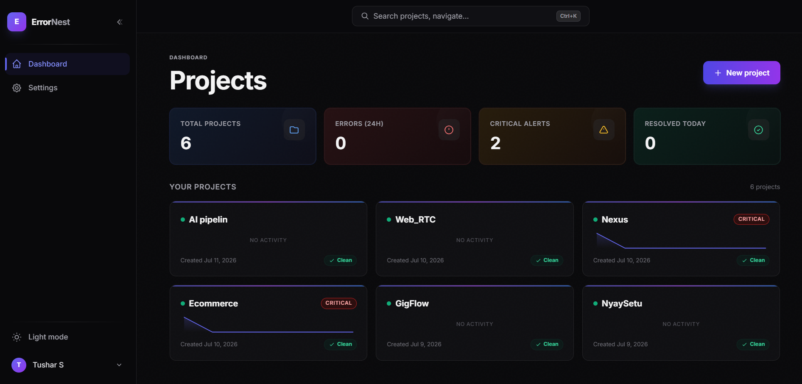
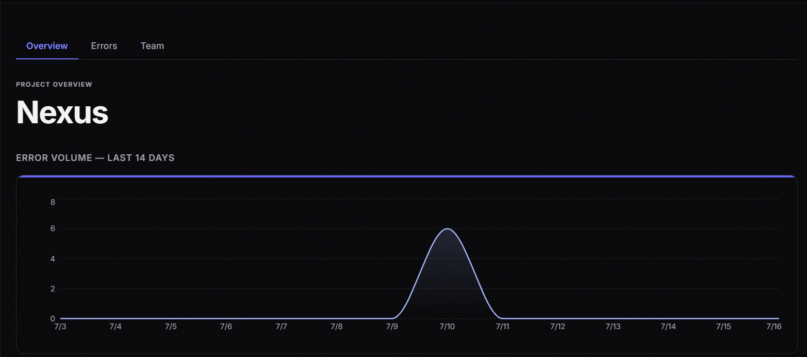
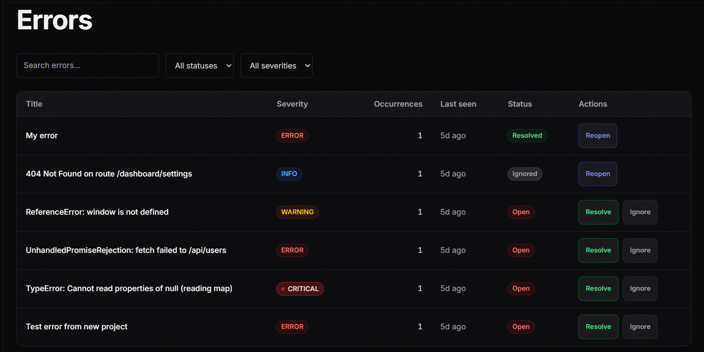
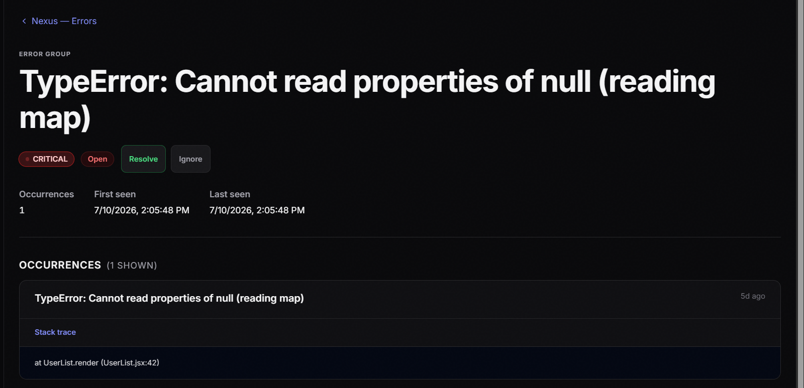
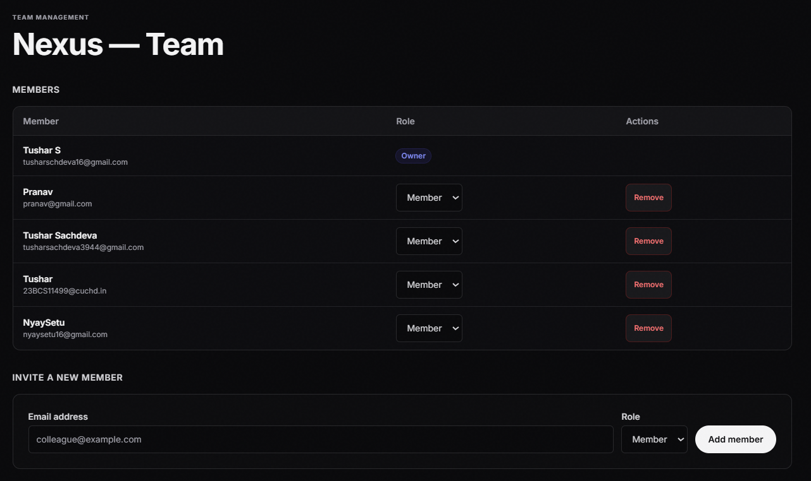

# ErrorNest

> A lightweight, self-hosted error monitoring platform — send your app's
> errors here, get grouped, searchable, real-time-ish visibility instead of
> waiting for users to complain.

!\\\[Hero screenshot](docs/screenshots/hero.png)

**Live demo → https://errornest.vercel.app**

> Built as part of the Digital Heroes Full Stack Developer Trial.

## Features

* Multi-project support with per-project API keys
* Error ingestion API with automatic fingerprint-based grouping
* Dashboard with error volume charts and top-error breakdowns
* Search, filter (status/severity/date), and cursor-based pagination
* Role-based team access (Owner / Admin / Member / Viewer)
* Resolve / ignore workflow with optimistic UI
* Email alert on the first occurrence of a new critical error

## Tech Stack

Next.js (App Router) · TypeScript (strict) · PostgreSQL (Prisma) · Tailwind
CSS · Auth.js · Recharts · Vercel

## Quick Start

```bash
git clone https://github.com/you/errornest \\\&\\\& cd errornest
cp .env.example .env   # then fill in values
npm install
npm run db:migrate \\\&\\\& npm run db:seed
npm run dev             # http://localhost:3000
```

## Environment Variables

|Variable|Description|
|-|-|
|`DATABASE\\\_URL`|Postgres connection string|
|`AUTH\\\_SECRET`|Session signing secret (`openssl rand -base64 32`)|
|`NEXTAUTH\\\_URL`|Base URL for Auth.js callbacks|
|`BREVO\\\_API\\\_KEY`|Email provider key for critical-error and invite alerts|
|`EMAIL\\\_FROM`|Verified sender address for alert emails|

## Architecture

Business logic lives in `src/server/services/`, data access in
`src/server/repositories/`, and both are wired through interfaces in
`src/server/domain/`. See [docs/architecture.md](docs/architecture.md) for
the data model diagram and why it's layered this way.

## Testing

```bash
npm run test       # unit
npm run test:e2e   # playwright
```

## Roadmap

- [x] Ingestion API + fingerprint grouping
- [x] RBAC + project scaffolding
- [x] Auth (signup/login)
- [x] Project creation + API key generation
- [x] Error dashboard with search/filter/pagination
- [x] Error detail view with occurrence history
- [x] Resolve/ignore/reopen actions with optimistic UI
- [x] Dashboard charts (14-day error volume)
- [x] Team invite + role management (RBAC-enforced)
- [ ] Slack notifier (swap-in via `INotifier`)
- [ ] Saved search views

## Screenshots

| Dashboard | Project Overview |
|---|---|
|  |  |

| Errors List | Error Detail |
|---|---|
|  |  |

| Team Management |
|---|
|  |

## Demo credentials

`demo@demo.com` / `demo1234` *(read-only demo account, once seeded)*

## License

MIT — see [LICENSE](LICENSE).

