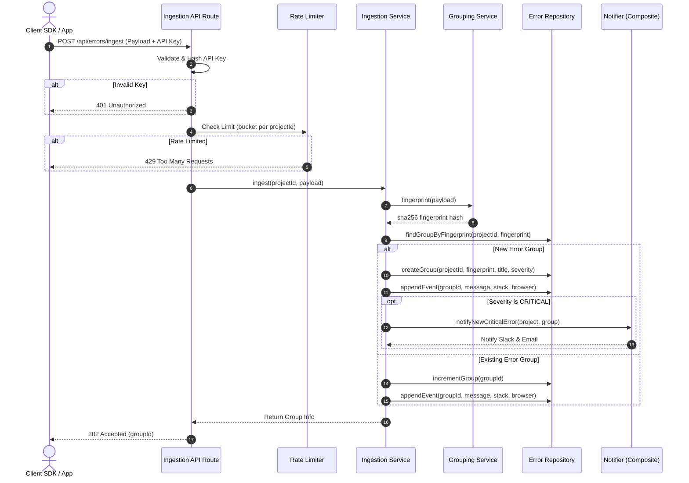

# 🚀 ErrorNest — Project Plan

> **ErrorNest** is a lightweight, self-hosted error-monitoring platform (inspired by Sentry). Client applications send error payloads to ErrorNest using an API key. ErrorNest automatically normalizes, groups, stores, and visualizes these errors on a project-by-project basis, offering role-based access control for team members.

---

## 🏗️ Technical Stack

- **Framework:** Next.js (App Router)
- **Language:** TypeScript (Strict Mode)
- **Database:** PostgreSQL
- **ORM:** Prisma
- **Styling:** Tailwind CSS + Vanilla CSS Variables (Dark/Light mode)
- **Authentication:** Auth.js (Credentials & Google/GitHub OAuth via Prisma Adapter)
- **Charts:** Recharts
- **Deployment:** Vercel / Docker

---

## 📋 1. User Stories

- **As a New User,** I can sign up with my credentials or continue with Google/GitHub OAuth, and log in securely.
- **As a Project Owner,** I can create projects and generate unique API keys for ingestion.
- **As a Client Application,** I can `POST` error payloads using an `x-api-key` header to a public ingestion endpoint.
- **As a Team Member,** I can be invited to projects with specific roles (`OWNER`, `ADMIN`, `MEMBER`, `VIEWER`) controlling my permissions.
- **As a Dashboard User,** I can:
  - View overall error volume over time using charts.
  - Browse a list of error groups sorted by recency or frequency.
  - Search and filter errors by project, status (`OPEN`, `RESOLVED`, `IGNORED`), severity, and date range.
  - Save my custom search filters for quick reuse (**Saved Searches**).
  - Drill down into an error group to inspect its stack traces, browser metadata, context, and individual event occurrences.
- **As an Admin/Owner,** I can resolve or ignore error groups and manage team members' roles.
- **As an Owner/Admin,** I can configure email (via Brevo) and Slack alerts to notify the team on new critical errors.

---

## 🗄️ 2. Core Entities & Data Shapes

```
  +--------------+          +-------------------+          +-------------+
  |     User     | <------- |   ProjectMember   | -------> |   Project   |
  +--------------+          +-------------------+          +-------------+
         |                                                        |
         | (Saved searches)                                       |--< ApiKey
         v                                                        |
  +--------------+                                                |--< ErrorGroup
  | SavedSearch  | >----------------------------------------------|         |
  +--------------+                                                          |--< ErrorEvent
                                                                            |
                                                                            └──< Notification
```

### Entity Fields

```text
User           - id, email, passwordHash?, name, image?, company, bio, emailVerified?, emailVerifiedAt?, createdAt, updatedAt
Account        - id, userId, type, provider, providerAccountId, refresh_token?, access_token?, expires_at?, token_type?, scope?, id_token?, session_state?
Session        - id, sessionToken, userId, expires
VerificationToken - identifier, token, expires
Project        - id, name, slug, ownerId, createdAt, deletedAt?
ApiKey         - id, projectId, keyHash, label, createdAt, revokedAt?
ProjectMember  - id, projectId, userId, role (OWNER | ADMIN | MEMBER | VIEWER), createdAt
SavedSearch    - id, projectId, userId, name, filters (JSON), createdAt
ErrorGroup     - id, projectId, fingerprint (hash), title, status (OPEN | RESOLVED | IGNORED),
                 severity (INFO | WARNING | ERROR | CRITICAL), occurrenceCount, firstSeenAt, lastSeenAt
ErrorEvent     - id, errorGroupId, message, stackTrace?, browser?, url?, userContext (JSON)?, createdAt
Notification   - id, projectId, errorGroupId, channel ("EMAIL" | "SLACK"), sentAt
```

### 🧠 Fingerprinting & Grouping Logic
An incoming error's fingerprint is computed using:

$$\text{hash}(\text{project} + \text{normalizedErrorMessage} + \text{topStackFrameLine})$$

- Identical hashes resolve to the same `ErrorGroup`, incrementing `occurrenceCount` and appending a new `ErrorEvent`.
- **Edge cases handled:**
  - Burst arrivals (e.g., 100 events/sec) are batched to avoid DB locks.
  - Missing stack traces fallback to grouping purely by normalized message content.
  - Dynamic ID parameters in error messages (e.g., `User 123 not found`) are normalized (e.g., `user # not found`) to prevent group fragmentation.

---

## 🏛️ 3. Architecture & Clean Separation

ErrorNest strictly separates **business logic (services)** from **data access (repositories)** and **delivery (API routes/server actions)** using the dependency inversion principle.

### Ingestion Flow Diagram



### 📁 Codebase Directory Structure

```text
src/
├── app/                         # Routing Layer: Lean Next.js pages & endpoints
│   ├── (auth)/                  # Authentication (login, signup, verify-email)
│   ├── (dashboard)/             # Project management and analytics views
│   │   ├── projects/
│   │   │   └── [id]/
│   │   │       ├── errors/      # Error listings, detail views, and saved searches
│   │   │       └── team/        # Member management and role settings
│   └── api/
│       └── errors/
│           └── ingest/
│               └── route.ts     # Public endpoint for ingesting error events
├── server/
│   ├── domain/                  # Core Business Domains (Framework-free)
│   │   ├── entities.ts          # Pure domain models and TypeScript interfaces
│   │   └── repositories.ts      # Repository interface definitions (IErrorRepository, etc.)
│   ├── repositories/            # Data Access: Concrete Prisma database implementations
│   │   ├── prisma-api-key.repository.ts
│   │   ├── prisma-error.repository.ts
│   │   ├── prisma-project.repository.ts
│   │   └── prisma-saved-search.repository.ts
│   ├── services/                # Business Logic Services (depends only on interfaces)
│   │   ├── grouping.service.ts  # Normalized error fingerprint calculation
│   │   ├── ingestion.service.ts # Ingests, hashes, dedupes, and alerts on errors
│   │   ├── project.service.ts   # Project creation and verification flow
│   │   └── rbac.service.ts      # Enforces role permissions (assertRole)
│   └── notifiers/               # Alert channels (implementing INotifier interface)
│       ├── notifier.interface.ts
│       ├── email.notifier.ts    # Sends emails via Brevo SMTP API
│       └── slack.notifier.ts    # Posts formatted alerts to Slack Webhook channels
├── components/                  # Shared UI components (Charts, Buttons, Toasts)
└── lib/                         # Generic Utilities (db client, rate limit, env validation)
```

> [!TIP]
> **Why this split matters:**
> - **S (Single Responsibility):** Each class does exactly one thing. Swapping Prisma for another ORM or database only requires changing the files under `server/repositories/`.
> - **O (Open/Closed):** To support another alert channel (e.g., Discord or Webhooks), we just implement `INotifier` in a new file under `server/notifiers/` without modifying `IngestionService`.
> - **D (Dependency Inversion):** Services never import Prisma directly; they rely on abstract repository parameters, enabling offline unit testing using mock/in-memory repositories.

---

## 📈 4. Scalability & Optimization Choices

- **Indices:** Compound index on `(projectId, fingerprint)` speeds up grouping lookups. A composite index on `(projectId, status, lastSeenAt)` optimizes dashboard queries.
- **Cursor Pagination:** Avoids SQL `OFFSET` performance degradation under large record sizes (>10k errors).
- **Composite Alerts:** Alerts on new `CRITICAL` error groups are routed through a `CompositeNotifier` to dispatch emails and Slack webhook payloads concurrently.
- **Materialized Trends:** Historical trend lines are built on aggregated counts to avoid scanning millions of raw event rows during dashboard loads.
- **In-Memory Rate Limiting:** A memory-efficient token-bucket implementation is utilized for local development; it is designed to be easily swapped for Redis in cluster environments.

---

## 🔌 5. API & Server Actions Surface

| Action / Endpoint | Method | Authentication | Notes |
| :--- | :--- | :--- | :--- |
| **Ingest Error** | `POST /api/errors/ingest` | API Key (`x-api-key`) | Rate-limited, public endpoint |
| **List Projects** | Server Action | Auth Session Cookie | Scope restricted to active memberships |
| **Create Project** | Server Action | Auth Session Cookie | Automatically creates default API key |
| **List Error Groups** | Server Action | Auth Session Cookie + RBAC | Filters: status, severity, query, saved searches |
| **Get Group Details** | Server Action | Auth Session Cookie + RBAC | Includes paginated child occurrences |
| **Update Group Status**| Server Action | Session + Role $\ge$ `MEMBER` | Marks as OPEN, RESOLVED, or IGNORED |
| **Invite Team Member** | Server Action | Session + Role $\ge$ `ADMIN` | Dispatches invitation email notifier |
| **Update Member Role** | Server Action | Session + Role $=$ `OWNER` | Upgrades/downgrades member permissions |

---

## 📅 6. Day-by-Day Development Plan

| Day | Focus / Deliverable | Key Details |
| :---: | :--- | :--- |
| **Day 1** | **Base Scaffold & DB Setup** | Git CI pipeline configured. Prisma schema and seed scripts established. Domain interface layers defined. Auth.js wired. |
| **Day 2** | **Project Management** | Project CRUD operations. Key creation & hashing functions. Core navigation layout and dashboard shell. |
| **Day 3** | **Ingestion Pipeline** | API key routing. Ingest service & normalization. Grouping engine. Local simulation scripts to populate fake errors. |
| **Day 4** | **Error Explorer** | Error grid tables. Filters, search inputs, saved searches. Cursor pagination. Error occurrence details view. |
| **Day 5** | **Insights & Actions** | Recharts integration for error trend charts. Status transitions with optimistic updates and toasts. |
| **Day 6** | **RBAC & Notifiers** | Role-based authorization assertions. Team invitation forms. Brevo + Slack webhooks integrated for alerts. |
| **Day 7** | **Polish & Handover** | SEO configuration. CSS variable theme checks. Accessibility and responsive design. Walkthrough and Loom demo documentation. |

---

## 💬 7. Assumptions & Constraints

1. **Emailing:** Brevo SMTP configuration relies on valid environment variable keys. Emails will gracefully bypass if key variables are missing.
2. **Mock Agent:** Errors will be simulated using a seeding CLI script since there is no actual Client SDK bundle compiled for this timebox.
3. **RBAC Rule:** Project security acts at the backend level. Front-end components hide control panels matching user roles, but all actions perform a secondary DB validation check via `RbacService`.
